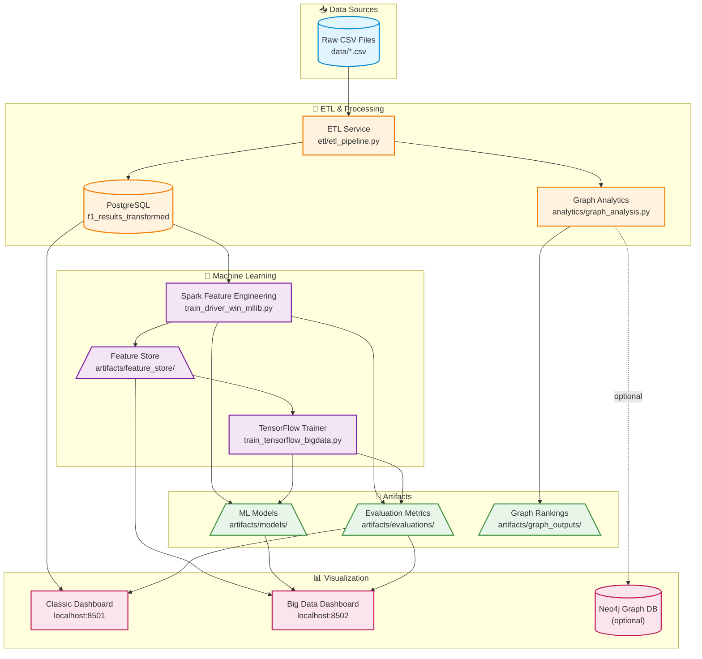

# Formula 1 ML Pipeline

This repository orchestrates an end-to-end Formula 1 analytics workflow covering ETL, classic machine-learning models, big data pipelines (Spark + TensorFlow), and dual dashboards. The folder layout and numbered runbooks are designed so newcomers can follow the execution order without hunting through the codebase.

## Project layout (execution order)

| Step | Folder | Purpose |
| --- | --- | --- |
| 01 | `docs/runbooks/` | Numbered guides that walk through environment setup, ETL, ML pipelines, and dashboards. |
| 02 | `etl/` | Spark-enabled ETL scripts that hydrate the `f1_results_transformed` table. |
| 03 | `pipelines/classic/` | Scikit-learn & XGBoost trainers that read/write Postgres tables. |
| 04 | `pipelines/bigdata/` | Spark feature engineering and TensorFlow training jobs that work on large artefacts. |
| 05 | `dashboard/` | Streamlit apps (`classic_app.py`, `bigdata_app.py`) served via dedicated Docker services. |
| — | `ml/` | Legacy container entrypoints (kept for compatibility) now delegating to the classic pipeline code. |
| — | `docs/reference/` | Longer-form documentation and design notes. |
| — | `artifacts/` | Output directory mounted by containers for feature stores, models, and evaluation JSONs. |
| — | `archive/unused/` | Legacy scripts, logs, and guides kept for reference but no longer part of the main flow. |

## Quick start

1. Follow `docs/runbooks/01-environment-setup.md` to build images and start infrastructure.
2. Run `docs/runbooks/02-data-ingest-etl.md` to populate Postgres.
3. Choose between the classic (`docs/runbooks/03-classic-ml-workflow.md`) or big data (`docs/runbooks/04-bigdata-ml-workflow.md`) pipelines—or execute both.
4. Launch dashboards using `docs/runbooks/05-dashboards.md` to explore results.

## Architecture diagram

## Docker services overview

| Service | Description |
| --- | --- |
| `postgres` | Primary datastore for ETL outputs and classic ML predictions. |
| `etl` | One-shot container that executes the ETL pipeline. |
| `ml_train` | Runs the classic ML trainers. |
| `spark-master`, `spark-worker-*` | Spark cluster backing the big data feature engineering job. |
| `dashboard_classic` | Streamlit app on port 8501 reading Postgres tables. |
| `dashboard_bigdata` | Streamlit app on port 8502 visualising artefacts in `artifacts/`. |
| `pgadmin` | Optional Postgres UI for manual inspection. |
| `neo4j` | Optional knowledge graph store backing the graph analytics export. |

## Architecture Documentation

Comprehensive architecture diagrams and documentation are available in the `docs/` folder:

- **[Star Schema Design](docs/star_schema.md)** - Dimensional data model with fact/dimension tables optimized for analytics and ML feature engineering
- **[IT Infrastructure Architecture](docs/infrastructure_architecture.md)** - Docker Compose service architecture, network topology, data flows, and deployment guide
- **[Architecture Overview](docs/README.md)** - Quick reference and integration guide for both diagrams

These documents include:
- Mermaid diagrams (auto-rendered on GitHub)
- Detailed component descriptions
- SQL query patterns for ML features
- Scaling and security recommendations
- Monitoring and disaster recovery strategies

## Contribution tips

- Keep new documentation in the appropriate numbered runbook or reference folder so the execution order remains obvious.
- Whenever you introduce a new pipeline stage, describe its inputs/outputs in the relevant README and update the root table above.
- Use the `artifacts/` folder (or override via env vars) for outputs so dashboards and collaborators can locate results automatically.
- Update architecture diagrams in `docs/` when modifying database schema or infrastructure services.
