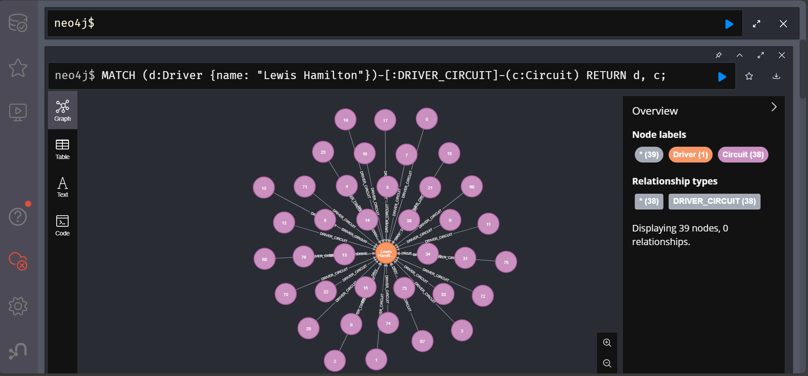

# Graph Analytics Sample View

## Run the graph analytics script

From the project root the script builds the NetworkX graph, prints top drivers/constructors/circuits, and optionally exports to Neo4j:

```powershell
python analytics/graph_analysis.py --base-path data --top-k 10 `
   --neo4j-uri bolt://localhost:7687 `
   --neo4j-user neo4j `
   --neo4j-password neo4j123 `
   --neo4j-wipe
```

Omit the `--neo4j-*` flags if you only want the console output and CSV exports under `artifacts/graph_outputs/`.

## Inspecting the graph in Neo4j

### Sample driver–circuit slice (top 50 relationships)

Run the query below inside the Neo4j Browser to get a quick sanity check that nodes and relationships loaded correctly. The screenshot (`docs/figures/Screenshot 2025-11-01 010037.png`) captures the output in Graph view.

```cypher
MATCH (n)-[r]->(m)
RETURN n, r, m
LIMIT 50;
```


Interpretation: the first 50 driver-to-circuit relationships form a hub-and-spoke pattern. Driver nodes (orange) with higher degree—for example Oscar Larrauri, Philippe Streiff, Adrián Campos, Joachim Winkelhock—appear near the centre because they connect to many circuits even within this truncated sample. Circuit nodes (purple) sit on the outer ring; the more edges a circuit has, the more often it appears in historical results. Every edge is labelled `DRIVER_CIRCUIT`, indicating the driver raced at that venue at least once. Switching to the Table pane reveals the `weight` property so you can see how many times each driver–circuit pair occurs in the source data.

### Key observations from the top-50 slice

- **Two node labels are present**: `Driver` (orange) and `Circuit` (purple). Every displayed relationship is of type `DRIVER_CIRCUIT`, meaning the driver has raced on that circuit at least once.
- **Driver nodes with high degree** (for example Oscar Larrauri, Philippe Streiff, Adrián Campos, Joachim Winkelhock) sit near the centre because they share edges to many circuits in the first 50 relationships returned. These are not necessarily the globally most connected drivers—only the most connected within this sample.
- **Circuit nodes** form the outer halo. Circuits with higher weighted degree have more incident driver edges, which indicates venues that appeared frequently in the filtered subset.
- **Edge labels** indicate the aggregated relationship type (`DRIVER_CIRCUIT`). When you switch to the table view you can see the `weight` property; a higher weight means the same driver–circuit pair appears in multiple race results.

## Driver career breadth snapshot (Lewis Hamilton)

```cypher
MATCH (d:Driver {name: "Lewis Hamilton"})-[:DRIVER_CIRCUIT]-(c:Circuit)
RETURN d, c;
```



Interpretation: Lewis Hamilton (orange) sits at the centre connected to 38 circuit nodes (purple). Edge weight annotations show how many race entries tie him to each venue—higher numbers highlight circuits where he has appeared most frequently. Use the legend to hide labels or jump to the table view to inspect precise counts.

### Key observations from the career breadth view

- **Dense circuit coverage**: 38 distinct circuits connect to Hamilton, confirming how widely he has competed across the calendar.
- **Recurring venues**: Edges with higher weight (visible on hover in the Browser) highlight venues such as Silverstone or Monza where he has started repeatedly.
- **Single-driver focus**: Only one driver node appears, which makes it ideal for isolating a specific career but means cross-driver comparisons require separate queries or aggregations.


## Suggested Neo4j queries and interpretations

1. **Driver → Circuit neighbourhood**
   ```cypher
   MATCH (d:Driver {name: "Lewis Hamilton"})-[:DRIVER_CIRCUIT]-(c:Circuit)
   RETURN d, c
   ```
   Lists every circuit where the driver has recorded a race result. Use Graph view for visuals or aggregate into a table with `RETURN d.name AS driver, collect(DISTINCT c.name) AS circuits` when comparing drivers.

2. **Shared circuits between two drivers**
   ```cypher
   MATCH (d1:Driver {name: "Lewis Hamilton"})-[:DRIVER_CIRCUIT]-(c:Circuit)-[:DRIVER_CIRCUIT]-(d2:Driver)
   WHERE d2.name <> d1.name
   RETURN d1.name AS driver, d2.name AS teammate, collect(c.name) AS sharedCircuits
   ```
   Reveals overlap in circuit experience; filter further by year if needed.

3. **Circuit popularity**
   ```cypher
   MATCH (d:Driver)-[r:DRIVER_CIRCUIT]-(c:Circuit)
   RETURN c.name AS circuit, count(DISTINCT d) AS driverCount, sum(r.weight) AS starts
   ORDER BY driverCount DESC
   LIMIT 10;
   ```
   Highlights venues that appear most often across the dataset and the breadth of driver participation.

4. **Driver–constructor partnerships at specific circuits**
   ```cypher
   MATCH (d:Driver)-[:DRIVER_CONSTRUCTOR]-(con:Constructor),
      (d)-[:DRIVER_CIRCUIT]-(c:Circuit)
   WHERE c.name = "Silverstone Circuit"
   RETURN d.name, con.name
   ```
   Focuses on who raced for which constructor at a chosen circuit. Combine with timeframe filters (`WHERE r.year >= 2015`).

Interpret each result alongside the rankings produced by the Python script so you can tie local findings back to overall centrality metrics.

## Interpreting the sample view in context

1. Use the Browser’s legend (right-hand panel) to filter by label or relationship type. This helps isolate a single driver or circuit to inspect its local neighbourhood.
2. Toggle to the table view to see the quantitative values (weights, relation sets) corresponding to the visual edges.
3. Use the export button in the Browser to download the rendered PNG if you want to embed the current snapshot into reports. Save the file in a project directory such as `docs/figures/`.

## Tips for richer analysis

- Create more selective queries (by season, constructor, or championship position) to reduce clutter and highlight patterns relevant to your investigation.
- Combine the graph view with the rankings emitted by the script to cross-check which entities have the highest centrality versus which only appear locally dense in the visualisation.
- Consider enabling Neo4j Bloom for narrative exploration with natural-language-style searches once the dataset is loaded.
