# Formula 1 ML Pipeline - IT Infrastructure Architecture

## Overview
This document describes the containerized IT infrastructure for the Formula 1 machine learning pipeline, including data storage, processing engines, model training services, and visualization dashboards.

## Infrastructure Diagram

```mermaid
graph TB
    subgraph "External Users"
        USER[User/Data Scientist]
        ANALYST[Business Analyst]
    end
    
    subgraph "Data Sources"
        CSV[("CSV Files<br/>data/*.csv")]
    end
    
    subgraph "Docker Network: f1_network"
        
        subgraph "Data Storage Layer"
            POSTGRES[("PostgreSQL 16<br/>f1_postgres<br/>Port: 5432")]
            NEO4J[("Neo4j 5.22<br/>f1_neo4j<br/>Ports: 7474, 7687")]
            VOLUME_NEO4J[("Neo4j Volumes<br/>data, logs, import")]
            VOLUME_DATA[("Shared Volume<br/>./:/app")]
        end
        
        subgraph "ETL & Processing Layer"
            ETL["ETL Service<br/>etl_service<br/>Port: 8888<br/>(Python + Spark)"]
            SPARK_MASTER["Spark Master<br/>spark-master<br/>Ports: 7077, 8080"]
            SPARK_W1["Spark Worker 1<br/>spark-worker-1<br/>Port: 8081<br/>2 cores, 3GB RAM"]
            SPARK_W2["Spark Worker 2<br/>spark-worker-2<br/>Port: 8082<br/>2 cores, 3GB RAM"]
        end
        
        subgraph "ML Training Layer"
            ML_TRAIN["ML Training<br/>ml_train<br/>(Scikit-learn)"]
            SPARK_ML["Spark MLlib<br/>Feature Engineering<br/>+ RF Model"]
            TF_TRAIN["TensorFlow Training<br/>(Neural Network)"]
        end
        
        subgraph "Analytics Layer"
            GRAPH_ANALYTICS["Graph Analytics<br/>NetworkX + Neo4j"]
        end
        
        subgraph "Artifact Storage"
            ARTIFACTS[("Artifact Store<br/>artifacts/<br/>- models/<br/>- evaluations/<br/>- feature_store/<br/>- predictions/")]
        end
        
        subgraph "Visualization Layer"
            DASH_CLASSIC["Classic Dashboard<br/>dashboard_classic<br/>Port: 8501<br/>(Streamlit)"]
            DASH_BIGDATA["Big Data Dashboard<br/>dashboard_bigdata<br/>Port: 8502<br/>(Streamlit)"]
            PGADMIN["pgAdmin<br/>f1_pgadmin<br/>Port: 5050"]
        end
        
    end
    
    %% Data Flow - Ingestion
    CSV -->|Extract| ETL
    ETL -->|Transform with Spark| SPARK_MASTER
    SPARK_MASTER -->|Distribute Work| SPARK_W1
    SPARK_MASTER -->|Distribute Work| SPARK_W2
    ETL -->|Load| POSTGRES
    ETL -->|Graph Export| GRAPH_ANALYTICS
    GRAPH_ANALYTICS -->|Build Graph| NEO4J
    
    %% Data Flow - ML Training
    POSTGRES -->|Query Training Data| ML_TRAIN
    CSV -->|Read Features| SPARK_MASTER
    SPARK_MASTER -->|Feature Engineering| SPARK_ML
    SPARK_ML -->|Save Parquet/CSV| ARTIFACTS
    ARTIFACTS -->|Read Features| TF_TRAIN
    
    %% Data Flow - Model Artifacts
    ML_TRAIN -->|Save Models| ARTIFACTS
    SPARK_ML -->|Save MLlib Model| ARTIFACTS
    TF_TRAIN -->|Save Keras Model| ARTIFACTS
    
    %% Data Flow - Visualization
    POSTGRES -->|Query Results| DASH_CLASSIC
    ARTIFACTS -->|Read Metrics| DASH_CLASSIC
    ARTIFACTS -->|Read Metrics| DASH_BIGDATA
    POSTGRES -->|Admin Queries| PGADMIN
    NEO4J -->|Graph Queries| ANALYST
    
    %% External Access
    USER -->|View Dashboards| DASH_CLASSIC
    USER -->|View Dashboards| DASH_BIGDATA
    USER -->|Submit Spark Jobs| SPARK_MASTER
    USER -->|Run Training| ML_TRAIN
    USER -->|Run Training| TF_TRAIN
    ANALYST -->|DB Admin| PGADMIN
    ANALYST -->|Graph Browser| NEO4J
    
    %% Volume Mounts
    VOLUME_DATA -.->|Mount| ETL
    VOLUME_DATA -.->|Mount| SPARK_MASTER
    VOLUME_DATA -.->|Mount| SPARK_W1
    VOLUME_DATA -.->|Mount| SPARK_W2
    VOLUME_DATA -.->|Mount| DASH_CLASSIC
    VOLUME_DATA -.->|Mount| DASH_BIGDATA
    VOLUME_NEO4J -.->|Mount| NEO4J
    
    %% Styling
    classDef storage fill:#4A90E2,stroke:#2E5C8A,stroke-width:2px,color:#fff
    classDef processing fill:#50C878,stroke:#2E7D4E,stroke-width:2px,color:#fff
    classDef ml fill:#F39C12,stroke:#C87F0A,stroke-width:2px,color:#fff
    classDef viz fill:#E74C3C,stroke:#C0392B,stroke-width:2px,color:#fff
    classDef external fill:#95A5A6,stroke:#7F8C8D,stroke-width:2px,color:#fff
    
    class POSTGRES,NEO4J,VOLUME_NEO4J,VOLUME_DATA,CSV,ARTIFACTS storage
    class ETL,SPARK_MASTER,SPARK_W1,SPARK_W2,GRAPH_ANALYTICS processing
    class ML_TRAIN,SPARK_ML,TF_TRAIN ml
    class DASH_CLASSIC,DASH_BIGDATA,PGADMIN viz
    class USER,ANALYST external
```



## Component Details

### Data Storage Layer

#### PostgreSQL Database
- **Container**: `f1_postgres` (postgres:16)
- **Port**: 5432
- **Credentials**: 
  - User: `admin`
  - Password: `admin123`
  - Database: `f1_data`
- **Purpose**: Primary relational database for structured F1 data
- **Data**: Race results, drivers, constructors, circuits, standings
- **Initialization**: Auto-creates schema via `db/init.sql`
- **Health Check**: `pg_isready` with 10 retries

#### Neo4j Graph Database
- **Container**: `f1_neo4j` (neo4j:5.22)
- **Ports**: 
  - HTTP: 7474 (Browser)
  - Bolt: 7687 (Driver Protocol)
- **Credentials**: `neo4j/neo4j123`
- **Purpose**: Graph analytics for driver/constructor/circuit relationships
- **Volumes**: 
  - `./neo4j/data:/data` (graph database)
  - `./neo4j/logs:/logs` (query logs)
  - `./neo4j/import:/import` (bulk import)
- **Use Cases**: PageRank, betweenness centrality, community detection

#### Shared Volume
- **Mount**: `.:/app` (host → container)
- **Access**: All services read/write to shared workspace
- **Contents**:
  - Source code (`etl/`, `ml/`, `pipelines/`)
  - Input data (`data/`)
  - Output artifacts (`artifacts/`)

### ETL & Processing Layer

#### ETL Service
- **Container**: `etl_service`
- **Base Image**: Custom Dockerfile (Python 3.x + PySpark)
- **Port**: 8888 (Jupyter for debugging)
- **Dependencies**: `postgres`, `spark-master`
- **Workflow**:
  1. Wait for PostgreSQL readiness
  2. Extract CSVs → Pandas DataFrames
  3. Transform with Spark SQL
  4. Load to PostgreSQL
  5. Optional: Graph analytics → Neo4j
- **Environment Variables**:
  - `RUN_GRAPH_ANALYTICS`: Enable graph export
  - `GRAPH_NEO4J_URI`: Neo4j connection string
  - `GRAPH_NEO4J_WIPE`: Clear graph before import

#### Spark Cluster

**Spark Master**
- **Container**: `spark-master`
- **Base Image**: Custom (`pipelines/bigdata/spark/Dockerfile`)
- **Ports**: 
  - 7077 (Spark cluster)
  - 8080 (Web UI)
- **Mode**: Standalone cluster manager
- **Volumes**: `.:/app` (shared workspace)

**Spark Workers (2x)**
- **Containers**: `spark-worker-1`, `spark-worker-2`
- **Image**: `yenatari/formula1-ml-pipeline-spark-worker-1:latest`
- **Resources**: 
  - CPU: 2 cores each
  - RAM: 3GB each
- **Ports**: 8081, 8082 (Web UI)
- **Dependencies**: Connect to `spark://spark-master:7077`

### ML Training Layer

#### Classic ML Training
- **Container**: `ml_train`
- **Base Image**: Custom (`ml/Dockerfile`)
- **Framework**: Scikit-learn
- **Purpose**: Baseline models (Random Forest, XGBoost, etc.)
- **Input**: PostgreSQL tables
- **Output**: 
  - Pickled models → `artifacts/models/`
  - Metrics → `artifacts/evaluations/`

#### Spark MLlib Training
- **Execution**: Job submitted to Spark cluster
- **Script**: `pipelines/bigdata/spark/train_driver_win_mllib.py`
- **Purpose**: Scalable feature engineering + Random Forest
- **Workflow**:
  1. Read `data/f1_results_joined.csv`
  2. Compute rolling driver stats (win rate, avg points)
  3. Train Random Forest classifier
  4. Export feature store (Parquet + CSV shards)
  5. Save model to `artifacts/models/mllib_driver_win_rf`
- **Output**:
  - Feature store → `artifacts/feature_store/driver_features_csv/`
  - Model → `artifacts/models/mllib_driver_win_rf/`
  - Metrics → `artifacts/evaluations/mllib_driver_win_metrics.json`

#### TensorFlow Training
- **Execution**: Local Python or container
- **Script**: `pipelines/bigdata/tensorflow/train_tensorflow_bigdata.py`
- **Framework**: TensorFlow 2.x + Keras
- **Purpose**: Neural network with distributed training support
- **Input**: Feature store CSV shards from Spark
- **Workflow**:
  1. Read feature store via `tf.data.experimental.make_csv_dataset`
  2. Split train/val/test (70/20/10)
  3. Train feed-forward neural network
  4. Save Keras model + history + metrics
- **Output**:
  - Model → `artifacts/models/tf_driver_win/`
  - History → `artifacts/evaluations/tf_driver_win_history.json`
  - Metrics → `artifacts/evaluations/tf_driver_win_metrics.json`
- **Environment Variables**:
  - `F1_FEATURE_STORE_PATH`: Path to Spark feature store
  - `F1_TF_BATCH_SIZE`: Batch size (default: 512)
  - `F1_TF_EPOCHS`: Training epochs (default: 15)
  - `F1_TF_LR`: Learning rate (default: 0.001)

### Analytics Layer

#### Graph Analytics
- **Module**: `analytics/graph_analysis.py`
- **Framework**: NetworkX (Python)
- **Purpose**: Build and analyze F1 entity relationships
- **Analyses**:
  - PageRank (driver/constructor importance)
  - Betweenness centrality (circuit influence)
  - Community detection (team eras)
- **Output**:
  - Cypher scripts → `neo4j/import/`
  - Metrics JSON → `artifacts/`
- **Neo4j Integration**: Bulk import via Cypher CREATE statements

### Visualization Layer

#### Classic Dashboard
- **Container**: `dashboard_classic` (Streamlit)
- **Port**: 8501
- **App**: `dashboard/classic_app.py`
- **Purpose**: Traditional ML metrics and PostgreSQL-based analytics
- **Features**:
  - Model performance comparison
  - Driver/constructor statistics
  - Race result trends
  - Query execution against PostgreSQL

#### Big Data Dashboard
- **Container**: `dashboard_bigdata` (Streamlit)
- **Port**: 8502
- **App**: `dashboard/bigdata_app.py`
- **Purpose**: Spark/TensorFlow artifact visualization
- **Features**:
  - Feature store inspection
  - MLlib vs TensorFlow metrics
  - Training history charts
  - Artifact status indicators

#### pgAdmin
- **Container**: `f1_pgadmin` (dpage/pgadmin4)
- **Port**: 5050
- **Credentials**:
  - Email: `admin@admin.com`
  - Password: `admin`
- **Purpose**: PostgreSQL administration and SQL query interface

## Network Architecture

### Docker Network
- **Name**: `f1_network`
- **Driver**: Bridge
- **Purpose**: Internal service discovery and communication
- **DNS**: Automatic service-to-service resolution (e.g., `f1_postgres:5432`)

### Port Mappings
| Service | Internal Port | External Port | Protocol |
|---------|--------------|---------------|----------|
| PostgreSQL | 5432 | 5432 | TCP |
| Neo4j HTTP | 7474 | 7474 | HTTP |
| Neo4j Bolt | 7687 | 7687 | Bolt |
| Spark Master | 7077 | 7077 | TCP |
| Spark Master UI | 8080 | 8080 | HTTP |
| Spark Worker 1 UI | 8081 | 8081 | HTTP |
| Spark Worker 2 UI | 8082 | 8082 | HTTP |
| ETL Jupyter | 8888 | 8888 | HTTP |
| Classic Dashboard | 8501 | 8501 | HTTP |
| Big Data Dashboard | 8502 | 8502 | HTTP |
| pgAdmin | 80 | 5050 | HTTP |

## Data Flow Pipelines

### Pipeline 1: ETL Ingestion
```
CSV Files → ETL Service → Spark Transform → PostgreSQL
                     ↓
            Graph Analytics → Neo4j
```

### Pipeline 2: Classic ML Workflow
```
PostgreSQL → ML Train Service → Scikit-learn Models → Artifacts
```

### Pipeline 3: Big Data ML Workflow
```
CSV → Spark Master → Feature Engineering → Feature Store (Parquet/CSV)
                          ↓
                     MLlib Model → Artifacts
                          
Feature Store → TensorFlow Training → Keras Model → Artifacts
```

### Pipeline 4: Visualization
```
PostgreSQL + Artifacts → Streamlit Dashboards → User
Neo4j → Graph Browser → Analyst
```

## Deployment & Orchestration

### Docker Compose Configuration
- **File**: `docker-compose.yml`
- **Version**: Compatible with Docker Compose v2+
- **Services**: 11 containers total
- **Restart Policy**: `unless-stopped` for data stores and Spark cluster
- **Health Checks**: PostgreSQL only (pg_isready)

### Startup Sequence
1. **Data Stores**: `postgres`, `neo4j` (independent startup)
2. **Spark Cluster**: `spark-master` → `spark-worker-1`, `spark-worker-2`
3. **ETL**: `etl_service` (depends on `postgres`, `spark-master`)
4. **ML Training**: `ml_train` (depends on `postgres`, `etl`)
5. **Dashboards**: `dashboard_classic`, `dashboard_bigdata` (depends on data availability)
6. **Admin Tools**: `pgadmin` (depends on `postgres`)

### Common Operations

**Start All Services**
```powershell
docker-compose up -d
```

**View Logs**
```powershell
docker-compose logs -f [service_name]
```

**Check Service Status**
```powershell
docker-compose ps
```

**Submit Spark Job**
```powershell
docker-compose exec spark-master /opt/spark/bin/spark-submit /app/pipelines/bigdata/spark/train_driver_win_mllib.py
```

**Run TensorFlow Training**
```powershell
# Set feature store path for local execution
$env:F1_FEATURE_STORE_PATH = "C:\Users\Lenovo\Downloads\formula1-ml-pipeline\artifacts\feature_store"
python pipelines/bigdata/tensorflow/train_tensorflow_bigdata.py
```

**Access Dashboards**
- Classic: http://localhost:8501
- Big Data: http://localhost:8502
- Spark Master UI: http://localhost:8080
- pgAdmin: http://localhost:5050
- Neo4j Browser: http://localhost:7474

## Security Considerations

### Current Configuration
- **Development Mode**: Hardcoded credentials in docker-compose.yml
- **Network Isolation**: Services communicate within `f1_network`
- **Port Exposure**: All services exposed to host for development access

### Production Recommendations
1. **Secrets Management**: Use Docker secrets or external vault
2. **Environment Variables**: Externalize credentials to `.env` file (not in repo)
3. **Network Segmentation**: Separate data, processing, and presentation networks
4. **TLS/SSL**: Enable encrypted connections for PostgreSQL, Neo4j
5. **Authentication**: 
   - Enable Spark authentication
   - Use token-based auth for dashboards
   - Restrict pgAdmin access via VPN
6. **Firewall Rules**: Restrict external access to only necessary ports

## Scalability & Performance

### Current Capacity
- **Spark Workers**: 2 workers × 2 cores × 3GB = 4 cores, 6GB total
- **Dataset Size**: Suitable for ~30K race results, 1M+ lap times
- **Training Time**: 
  - Spark MLlib: ~2-5 minutes
  - TensorFlow: ~5-10 minutes (15 epochs)

### Scaling Strategies
1. **Horizontal Spark Scaling**: Add more worker containers
   ```yaml
   spark-worker-3:
     image: yenatari/formula1-ml-pipeline-spark-worker-1:latest
     # ... same config as worker-1
   ```

2. **Resource Allocation**: Increase worker memory/cores
   ```yaml
   environment:
     SPARK_WORKER_CORES: "4"
     SPARK_WORKER_MEMORY: 8G
   ```

3. **Partitioning**: Use Spark partitioning for larger datasets
   ```python
   spark.conf.set("spark.sql.shuffle.partitions", "400")
   ```

4. **Distributed TensorFlow**: Enable multi-worker training
   ```python
   # Set TF_CONFIG environment variable
   os.environ["TF_CONFIG"] = json.dumps({
       "cluster": {"worker": ["host1:port", "host2:port"]},
       "task": {"type": "worker", "index": 0}
   })
   ```

## Monitoring & Observability

### Available Metrics
- **Spark**: Web UI (http://localhost:8080) shows job progress, stage timings, executor metrics
- **PostgreSQL**: pgAdmin query analyzer
- **Dashboards**: Built-in metrics visualization in Streamlit apps

### Recommended Additions
1. **Prometheus + Grafana**: Scrape metrics from Spark, containers
2. **ELK Stack**: Centralized logging for all services
3. **Jaeger/Zipkin**: Distributed tracing for data pipelines
4. **cAdvisor**: Container resource usage monitoring

## Disaster Recovery

### Backup Strategy
- **PostgreSQL**: Scheduled pg_dump via cron
- **Neo4j**: Built-in backup command (`neo4j-admin dump`)
- **Artifacts**: Sync to S3/Azure Blob Storage
- **Code**: Git repository

### Recovery Procedures
1. **Database Restore**: 
   ```bash
   docker-compose exec postgres pg_restore -U admin -d f1_data /backup/dump.sql
   ```

2. **Neo4j Restore**:
   ```bash
   docker-compose exec neo4j neo4j-admin load --from=/backup/graph.dump
   ```

3. **Full Stack Rebuild**:
   ```bash
   docker-compose down -v
   docker-compose up -d
   # Re-run ETL pipeline
   ```

## Cost Optimization (Cloud Deployment)

### AWS Architecture Mapping
- **PostgreSQL** → RDS PostgreSQL
- **Neo4j** → EC2 instance or Neo4j Aura
- **Spark Cluster** → EMR cluster (on-demand or spot)
- **ML Training** → SageMaker or EC2 GPU instances
- **Dashboards** → ECS Fargate or App Runner
- **Artifacts** → S3 buckets

### Cost Reduction Strategies
1. Use spot instances for Spark workers
2. Auto-scale EMR cluster based on job queue
3. Store cold data in S3 Glacier
4. Use RDS reserved instances for production databases
5. Implement CloudWatch alarms for resource usage

---

**Last Updated**: 2025-11-04  
**Author**: Formula 1 ML Pipeline Team  
**Infrastructure Version**: Docker Compose v2.x
