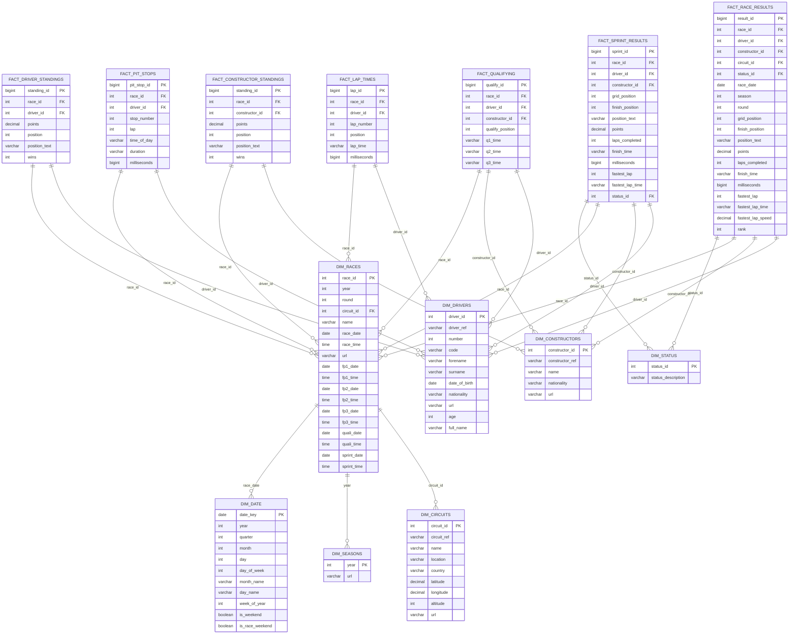

# Formula 1 ML Pipeline - Star Schema Design

## Overview
This document describes the dimensional data model (star schema) for the Formula 1 analytics and machine learning pipeline. The schema is optimized for analytical queries, ML feature engineering, and dashboard visualizations.

## Star Schema Diagram



## Schema Design Principles

### Fact Tables
The schema includes multiple **fact tables** representing measurable events and metrics:

1. **FACT_RACE_RESULTS** - Core fact table containing race outcomes, points, finishing positions, and performance metrics
2. **FACT_QUALIFYING** - Qualifying session results with Q1, Q2, Q3 times
3. **FACT_LAP_TIMES** - Detailed lap-by-lap performance data
4. **FACT_PIT_STOPS** - Pit stop events with timing and duration
5. **FACT_SPRINT_RESULTS** - Sprint race outcomes (introduced in recent seasons)
6. **FACT_CONSTRUCTOR_STANDINGS** - Constructor championship standings after each race
7. **FACT_DRIVER_STANDINGS** - Driver championship standings after each race

### Dimension Tables
**Dimension tables** provide descriptive context for fact table measures:

1. **DIM_DRIVERS** - Driver master data (demographics, identifiers)
2. **DIM_CONSTRUCTORS** - Constructor/team information
3. **DIM_CIRCUITS** - Circuit/track details with geographic coordinates
4. **DIM_RACES** - Race event details with session schedules
5. **DIM_SEASONS** - Season/year dimension
6. **DIM_STATUS** - Race finish status codes (finished, retired, DNF reasons)
7. **DIM_DATE** - Date dimension for time-based analysis

### Key Features

- **Snowflake elements**: `DIM_RACES` connects to `DIM_CIRCUITS` and `DIM_SEASONS`, creating a controlled snowflake pattern for better normalization
- **Conformed dimensions**: `DIM_DRIVERS`, `DIM_CONSTRUCTORS`, and `DIM_RACES` are shared across multiple fact tables
- **Additive measures**: Points, laps, milliseconds are fully additive across all dimensions
- **Semi-additive measures**: Rankings and positions are semi-additive (additive across some dimensions, not all)
- **Degenerate dimensions**: Some fact tables include direct attributes (like `season`, `round`) for query convenience

## ML Feature Engineering Views

The star schema supports the following analytical patterns used in ML pipelines:

### Driver Performance Aggregates
```sql
-- Rolling win rate and average points (used in Spark MLlib training)
SELECT 
    d.driver_id,
    r.year,
    r.round,
    SUM(CASE WHEN fr.finish_position = 1 THEN 1 ELSE 0 END) as total_wins,
    COUNT(*) as total_races,
    AVG(fr.points) as avg_points,
    AVG(fr.grid_position) as avg_grid,
    AVG(fr.finish_position) as avg_finish
FROM FACT_RACE_RESULTS fr
JOIN DIM_DRIVERS d ON fr.driver_id = d.driver_id
JOIN DIM_RACES r ON fr.race_id = r.race_id
GROUP BY d.driver_id, r.year, r.round
```

### Constructor Competitiveness
```sql
-- Team performance trends over seasons
SELECT 
    c.name as constructor,
    r.year,
    AVG(fr.points) as avg_points_per_race,
    SUM(fr.points) as season_points,
    COUNT(CASE WHEN fr.finish_position = 1 THEN 1 END) as wins
FROM FACT_RACE_RESULTS fr
JOIN DIM_CONSTRUCTORS c ON fr.constructor_id = c.constructor_id
JOIN DIM_RACES r ON fr.race_id = r.race_id
GROUP BY c.name, r.year
```

### Circuit Performance Analysis
```sql
-- Track-specific driver performance
SELECT 
    d.full_name,
    cir.name as circuit,
    COUNT(*) as races_at_circuit,
    AVG(fr.finish_position) as avg_finish,
    MIN(lt.milliseconds) as best_lap_ms
FROM FACT_RACE_RESULTS fr
JOIN DIM_DRIVERS d ON fr.driver_id = d.driver_id
JOIN DIM_RACES r ON fr.race_id = r.race_id
JOIN DIM_CIRCUITS cir ON r.circuit_id = cir.circuit_id
LEFT JOIN FACT_LAP_TIMES lt ON lt.race_id = r.race_id AND lt.driver_id = d.driver_id
GROUP BY d.full_name, cir.name
```

## Current Implementation Status

### Existing Tables
Currently, the pipeline loads a single denormalized table:
- `f1_results_transformed` (PostgreSQL) - Contains season, round, race_name, winner, constructor, laps, time

### Recommended Migration Path

1. **Phase 1**: Create dimension tables from existing CSVs
   - Load `DIM_DRIVERS`, `DIM_CONSTRUCTORS`, `DIM_CIRCUITS`, `DIM_SEASONS`, `DIM_STATUS`
   - Populate `DIM_RACES` from `races.csv`

2. **Phase 2**: Transform fact tables
   - Load `FACT_RACE_RESULTS` from `results.csv`
   - Load `FACT_QUALIFYING` from `qualifying.csv`
   - Load `FACT_LAP_TIMES` from `lap_times.csv`
   - Load `FACT_PIT_STOPS` from `pit_stops.csv`

3. **Phase 3**: Add derived fact tables
   - Populate `FACT_DRIVER_STANDINGS` from `driver_standings.csv`
   - Populate `FACT_CONSTRUCTOR_STANDINGS` from `constructor_standings.csv`
   - Populate `FACT_SPRINT_RESULTS` from `sprint_results.csv`

4. **Phase 4**: Create analytical views and materialized views
   - Build aggregated feature views for ML pipelines
   - Create pre-computed metrics for dashboards

## Benefits for ML Pipeline

1. **Feature Store Integration**: Star schema aligns with Spark feature engineering patterns
2. **Temporal Consistency**: Date dimensions enable proper time-series splits
3. **Efficient Joins**: Denormalized fact tables reduce join complexity in ML queries
4. **Scalability**: Partitioning strategies on `race_date` and `season` support big data workloads
5. **Data Quality**: Foreign key constraints ensure referential integrity

## Query Performance Optimization

### Recommended Indexes
```sql
-- Fact table indexes
CREATE INDEX idx_race_results_driver ON FACT_RACE_RESULTS(driver_id, race_date);
CREATE INDEX idx_race_results_constructor ON FACT_RACE_RESULTS(constructor_id, race_date);
CREATE INDEX idx_race_results_race ON FACT_RACE_RESULTS(race_id);

-- Dimension table indexes
CREATE INDEX idx_races_year_round ON DIM_RACES(year, round);
CREATE INDEX idx_drivers_nationality ON DIM_DRIVERS(nationality);
CREATE INDEX idx_circuits_country ON DIM_CIRCUITS(country);
```

### Partitioning Strategy
```sql
-- Partition large fact tables by year for query performance
CREATE TABLE FACT_RACE_RESULTS (
    ...
) PARTITION BY RANGE (season);

CREATE TABLE FACT_RACE_RESULTS_2020 PARTITION OF FACT_RACE_RESULTS
    FOR VALUES FROM (2020) TO (2021);
```

## Integration with Existing Pipeline

The star schema integrates with the current architecture:

- **ETL Pipeline** (`etl/etl_pipeline.py`): Modify to load star schema tables instead of flat `f1_results_transformed`
- **Spark Feature Engineering** (`pipelines/bigdata/spark/train_driver_win_mllib.py`): Query fact/dimension tables for richer features
- **TensorFlow Training** (`pipelines/bigdata/tensorflow/train_tensorflow_bigdata.py`): Consume feature store built from star schema
- **Dashboards** (`dashboard/`): Query aggregated views for faster rendering
- **Graph Analytics** (`analytics/graph_analysis.py`): Build Neo4j graph from dimension relationships

---

**Last Updated**: 2025-11-04  
**Author**: Formula 1 ML Pipeline Team
