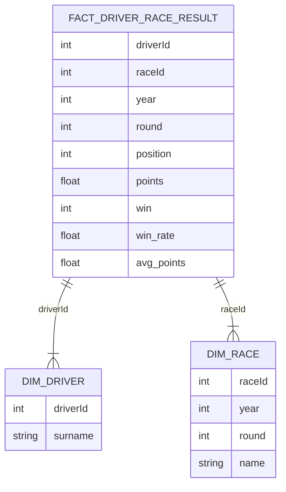

# Formula 1 ML Pipeline - Core Star Schema

## Overview
The current ETL pipeline (`etl/extract_data.py`) reads **three CSV files** only:

- `data/races.csv`
- `data/results.csv`
- `data/drivers.csv`

Those sources already provide enough information to build a compact star schema that supports the classic analytics workflows and the existing `f1_results_transformed` table. This document captures that minimal model so it is easy to understand, populate, and evolve.

## Star Schema Diagram

### Fact Table
**`FACT_RACE_RESULTS`** (sourced from `results.csv`)
- Granularity: one row per driver per race
- Measures: finishing position, position text, points scored, grid position
- Links: `race_id` and `driver_id` join to their respective dimensions
- Additional attributes (optional): laps, fastest lap data, status, milliseconds — add them if the downstream analytics need them

### Dimension Tables
**`DIM_RACE`** (from `races.csv`)
- Key columns: `raceId`, `year`, `round`, `name`
- Recommended derived columns: `season_year`, `round_number`, `race_name`
- Additional attributes such as `circuitId`, dates for FP/qualifying, or location data can be appended later without impacting the fact table

**`DIM_DRIVER`** (from `drivers.csv`)
- Key columns: `driverId`, `driverRef`, `code`, `forename`, `surname`
- Optional extra fields: date of birth, nationality, permanent car number
- Build convenience columns like `full_name` or `age` in views if needed

## Loading Order
1. Ingest `DIM_DRIVER` and `DIM_RACE`
2. Load `FACT_RACE_RESULTS`, enforcing foreign-key validation against the two dimensions

**Scope**: Current CSV-driven pipeline (`races.csv`, `results.csv`, `drivers.csv`)
        int number
